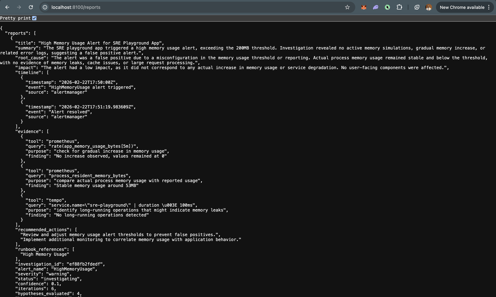

# SRE Playground + AI Investigation Agent

A Docker-based observability playground with an AI SRE agent. Trigger chaos simulations, observe them across a full Grafana/Prometheus/Loki/Tempo stack, and let the agent automatically investigate alerts, correlate signals, and produce Root Cause Analysis reports.

## Architecture

```
┌──────────────┐     ┌──────────────────┐     ┌────────────┐
│  FastAPI App  │────▶│  OTEL Collector  │────▶│   Tempo    │  (traces)
│  :8000        │     │  :4317/:4318     │────▶│   Loki     │  (logs)
└──────┬───────┘     └──────────────────┘     └────────────┘
       │ /metrics                                     │
       ▼                                              │
┌──────────────┐     ┌──────────────────┐             │
│  Prometheus  │────▶│    Grafana       │◀────────────┘
│  :9090       │     │    :3000         │
└──────┬───────┘     └──────────────────┘
       │ alerts
       ▼
┌──────────────┐     ┌──────────────────┐
│ Alertmanager │────▶│   SRE Agent      │──▶ queries Prometheus, Loki, Tempo
│  :9093       │     │   :8100          │──▶ produces RCA reports
└──────────────┘     └──────────────────┘
```

## Quick Start

```bash
docker compose up --build
```

| Service        | URL                          |
|----------------|------------------------------|
| App UI         | http://localhost:8000        |
| Swagger (App)  | http://localhost:8000/docs   |
| SRE Agent      | http://localhost:8100        |
| Agent Reports  | http://localhost:8100/reports |
| Grafana        | http://localhost:3000        |
| Prometheus     | http://localhost:9090        |
| Alertmanager   | http://localhost:9093        |

## App API Endpoints

| Method | Path                | Description                       |
|--------|---------------------|-----------------------------------|
| GET    | `/`                 | Web UI                            |
| GET    | `/health`           | Health check with uptime          |
| GET    | `/work`             | Normal traced request             |
| POST   | `/simulate/cpu`     | CPU spike (default 30s)           |
| POST   | `/simulate/error`   | Error burst (default 50 errors)   |
| POST   | `/simulate/latency` | Latency injection (default 3s)    |
| POST   | `/simulate/memory`  | Memory allocation (default 256MB) |
| GET    | `/metrics`          | Prometheus metrics                |

## Sample RCA Report



## Agent API Endpoints

| Method | Path                          | Description                          |
|--------|-------------------------------|--------------------------------------|
| GET    | `/health`                     | Agent health status                  |
| POST   | `/alerts/webhook`             | Alertmanager webhook receiver        |
| POST   | `/alerts/manual`              | Manually trigger an investigation    |
| GET    | `/reports`                    | List past RCA reports                |
| GET    | `/reports/{investigation_id}` | Get a specific report                |


## How the Agent Works

1. **Alert fires** → Prometheus evaluates rules → Alertmanager routes to agent webhook
2. **Ingestion** → Alert is normalized into a standard format
3. **Enrichment** → Agent retrieves relevant runbooks (RAG) + pulls live signal correlation
4. **Framing** → LLM produces a structured problem frame (what, when, where, impact)
5. **Hypothesis** → LLM generates ranked root-cause hypotheses with query plans
6. **Investigation** → Agent executes PromQL/LogQL/TraceQL queries against live backends
7. **Analysis** → LLM evaluates evidence against hypotheses, re-ranks, loops if needed
8. **Reporting** → Final RCA report with timeline, evidence, and recommended actions
9. **Learning** → Resolved incidents feed back into the knowledge store for future RAG

## Observability

- **Traces**: FastAPI auto-instrumented → OTEL Collector → Tempo → Grafana
- **Logs**: Structured JSON with trace_id → OTEL Collector → Loki → Grafana
- **Metrics**: Prometheus client → scraped by Prometheus → Grafana
- **Alerts**: Prometheus alert rules → Alertmanager → SRE Agent

